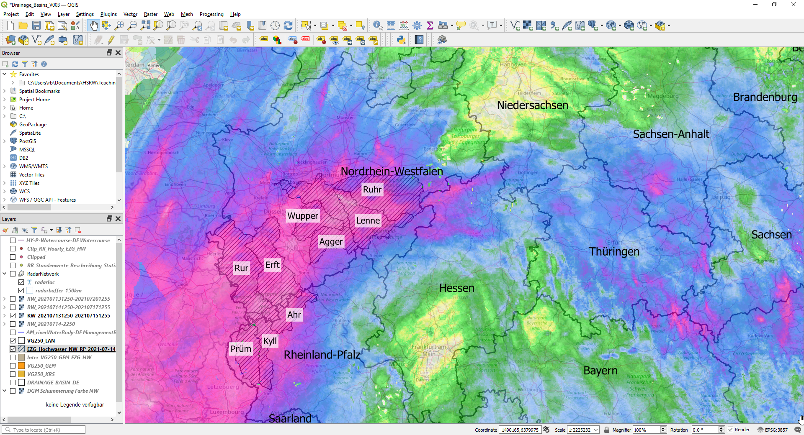

# Welcome to the course HSRW EE_3.07:  Fundamentals of Geodata Management Systems!

This git repository provides the **open educational resources (OER)** used in the 3rd semester course of the [**Environment & Energy Program**](https://www.hochschule-rhein-waal.de/en/faculties/communication-and-environment/degree-programmes/bachelor-degree-programmes/environment-and) at [**Rhine-Waal University of Applied Sciences (HSRW)**](https://www.hsrw.eu/). The course started in winter semester WS2019/20 for the first time. Course manager and instructor is Rolf Becker.

## Motivation
We live in a spatio-temporal world and use different systems to make our lives easier or to better understand our environment. Geospatial data (aka spatial data or geo data) is location dependent data related to the globe ("geo"). In fact real-world data is not just location dependent but also time varying, such as air temperature, land use, population development, traffic jams, or even city maps on a longer time scale. We use the term **geospatio-temporal data** to denote location and time dependent data. 

The course _HSRW EE_3.07: Fundamentals of Geodata Management Systems_ uses **free and open source software (FOSS)** to introduce the basic concepts of **geospatio-temporal data engineering**. Among the FOSS we use are the geographic information system (GIS) [**QGIS**](https://www.qgis.org/en/site/), the advanced object relation database management system [**PostgreSQL**](https://www.postgresql.org/) including its geospatial datadase extension [**PostGIS**](https://postgis.net/) as well as the programming language [**Python**](https://www.python.org/) together with the [**JupyterLab**](https://jupyter.org/) development environment. (We recommend the [**Anaconda**](https://www.anaconda.com/) Python distribution). This **free interoperable toolset** is an extremely powerful, widely used and well documented system for data engineering, management, analysis and presentation.

The course uses **open environmental data** to introduce concepts, study problems and develop solutions. Data sources are for example the [**NRW open geodata archive**](https://www.opengeodata.nrw.de/produkte/) of the German federal state of North Rhine-Westphalia (NRW) as well as the [**DWD climate data center**](https://www.dwd.de/EN/climate_environment/cdc/cdc_node_en.html) of the German Weather Service (Deutscher Wetterdienst, DWD), the [**European Copernicus Program**](https://www.copernicus.eu/en) including the Sentinel satellite data, the [**NASA Landsat satellites data collection**](https://landsat.gsfc.nasa.gov/data/), and many more. 

_Fig.: The 2021 severe flood in Germany. RADOLAN spatial precipitation distribution accumulated between 2021-07-13T12:50UTC and 2021-07-15T12:55UTC (two days) and the river catchments affected most by the extreme rainfall. The brightest pink areas showed a precipitation height above 80 mm._

## Learning outcomes / Competences and qualifications profile

Having passed this course students are able to describe the fundamental concepts of Geographic Information
Science and Technology. Students have demonstrated proficiency in the basic functions of geospatial software
including map creation, map projection and spatial analysis. They understand the potential of geospatial data
related web services. They know the concept of geospatial databases and have gained experience in using
relational databases for storing attribute data. Students are able to create own spatial data and to integrate
real‐time sensor data. They are aware of fundamental remote sensing and related spatial analysis techniques
and can create scripts to automate geospatial data processing.

# Content
* Geographic Information Systems (QGIS)
* Spatial data types
* Layers and mapping
* Spatial analysis
* Coordinate reference systems 
* Georeferencing
* Relational databases (PostgreSQL)
* Geodatabases (PostGIS)
* Web services (WMS, WCS, WFS)
* Real‐time sensor data integration
* Simple processing of remote sensing data
* Python scripting for geospatio-temporal data engineering and automated processing

## How to download or clone the course material

We use this git repository to disseminate the course material. It would be best if you used a Git client to **clone the repository** regularly. You can find more info on how to use git in the [Course Preparation Section](./gdms0020_Course_Preparation/README.md).
